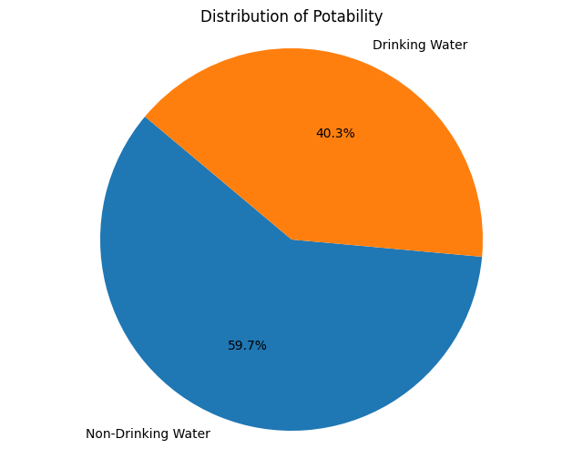
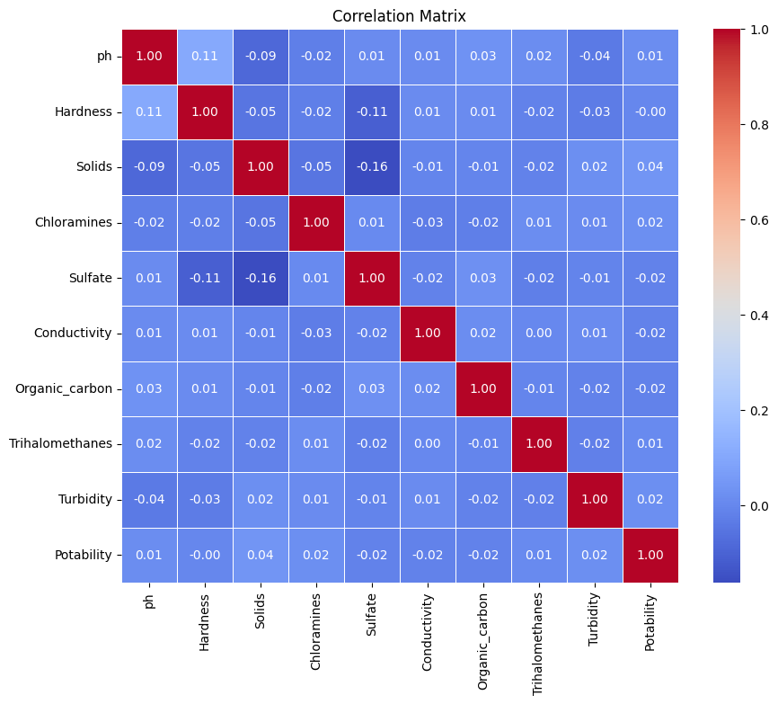
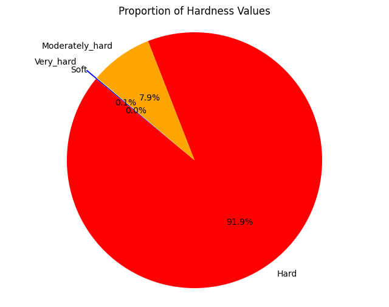

# H2OData_Dive
Explore portable water quality data for insights into pH, hardness, chloramines, sulfate, conductivity, and more. Analyze trends, correlations, and potability factors.

## Dataset Preparation

### Source of the Dataset
The dataset used in this project was obtained from Kaggle, a platform for data science and machine learning enthusiasts. The dataset specifically focuses on [add a brief description of the dataset, e.g., "drinking water quality"]. You can find the original dataset [here](https://www.kaggle.com/datasets/adityakadiwal/water-potability).

### Data Validation
While the dataset is not first-party data, steps were taken to ensure its validity and reliability. Several factors contribute to the confidence in the dataset:

- **Kaggle Platform**: Kaggle is a reputable platform known for hosting high-quality datasets and competitions. The dataset underwent a screening process by Kaggle moderators to ensure its suitability and compliance with community guidelines.
  
- **User Reviews and Ratings**: Before using the dataset, user reviews and ratings were considered to gauge the community's perception of the dataset's quality and usefulness. Positive reviews and high ratings indicate a level of trustworthiness.

- **Dataset Description and Metadata**: The dataset is accompanied by detailed descriptions and metadata, providing insights into its contents, variables, and data collection methodology. Understanding the dataset's characteristics aids in assessing its validity.

- **Data Exploration and Validation**: Prior to analysis, exploratory data analysis (EDA) was conducted to inspect the dataset for anomalies, inconsistencies, or irregularities. Data validation techniques were applied to ensure data integrity and accuracy.

Based on the above factors, it can be concluded that the dataset is reliable and suitable for analysis in the context of this project. While it is not first-party data, the steps taken to validate the dataset instill confidence in its usability and integrity.

## Data Processing Phase

### Handling Null Values
Null values present in the dataset were removed to ensure data integrity and accuracy. Various techniques, such as imputation or deletion, were employed based on the nature and distribution of missing data.

### Standardizing Float Values
Float values in the dataset were standardized to have two decimal places for consistency and ease of interpretation. This involved rounding off or truncating decimal values as appropriate.

## Analysis Phase

### Potability of Water Samples

To assess the potability of water samples in the dataset, a pie chart was prepared to visualize the percentage of samples suitable for drinking versus those unsuitable for drinking.

#### Results:
From the analysis:
- **40.3%** of the water samples are suitable for drinking.
- **59.7%** of the water samples are unsuitable for drinking.

### Correlation Analysis of Water Quality Factors

To understand the relationships between different factors affecting water quality, a correlation analysis was conducted and visualized using a heatmap.

#### Insights:
The heatmap revealed the following insights:
- **Weak Correlations**: Some weak correlations were observed, such as sulfate with solids and sulfate with hardness. However, these correlations were not significant.
- **Overall Low Correlation**: Generally, there is a lack of strong correlation between the analyzed factors. This suggests that the factors may influence water quality independently and are not strongly dependent on each other.

This correlation analysis provides valuable insights into the interplay between different factors affecting water quality. Understanding these relationships is crucial for effective water management and quality assessment.

### Water Hardness Classification

The water hardness classification was analyzed to understand the distribution of water samples across different hardness categories. It's important to note that the categories used in the analysis were derived from scientific sources related to water quality, as they were not explicitly included in the dataset.

#### Insights:
- **Hardness Range**: The hardness of water samples in the dataset varied between approximately 100 to 300 units.
- **Distribution of Hardness Categories**:
  - **Hard**: More than 91% of the water samples were classified as hard.
  - **Moderately Hard**: Approximately 7.9% of the water samples fell into the moderately hard category.
  - **Very Hard**: A small percentage (0.1%) of water samples were categorized as very hard.
  - **Soft**: No water samples were classified as soft in the dataset.

### Additional Information:
- The hardness categories used in the analysis were based on classifications from scientific sources related to water quality assessment.
- Utilize a bar chart or pie chart to visually represent the distribution of water hardness categories for better understanding.
- Provide clear labels and percentages on the chart to illustrate the proportion of samples in each category.

This analysis provides valuable insights into the prevalence of different water hardness categories in the dataset, derived from scientifically established classifications. These findings contribute to a better understanding of water quality assessment and treatment strategies.

# Data Science and Machine Learning

## Overview
This section details the extension of the project into data science, focusing on applying machine learning techniques to gain deeper insights and make predictions based on the dataset. The goal is to build predictive models, evaluate their performance, and derive actionable insights.

## Machine Learning Approach
Objective: Define the specific objectives of applying machine learning techniques. For instance, predicting water potability, identifying key factors affecting water quality, etc.

Data Preparation:

Feature Engineering: Describe any new features created or existing features transformed for machine learning.
Data Splitting: Explain how the dataset was split into training and testing sets. Include any details about validation sets or cross-validation if used.

## Data Preprocessing further

### Outlier Detection and Handling

To ensure the accuracy and reliability of the regression analysis, several preprocessing steps were undertaken to address outliers in the dataset:

- **Outlier Detection**: Outliers were initially identified using boxplots. Boxplots provide a visual representation of the distribution of data and help in identifying extreme values that deviate significantly from the rest of the data.

- **Outlier Handling Using IQR Method**: 
  - **Interquartile Range (IQR)**: The IQR method was employed to detect outliers. The IQR is calculated as the difference between the first quartile (Q1) and the third quartile (Q3) of the dataset. 
  - **Capping Outliers**: Instead of removing outliers, which can lead to data loss, the values were capped. This approach involves setting upper and lower bounds based on the IQR, ensuring that any value beyond these bounds is adjusted to the nearest boundary value.

### Feature Scaling

After handling outliers, feature scaling was performed to ensure that all variables contribute equally to the regression analysis:

- **Standardization**: Standardization was applied to scale features to have a mean of 0 and a standard deviation of 1. This process helps in normalizing the data and ensures that features with larger ranges do not disproportionately affect the model.

- **Min-Max Scaling**: Min-Max scaling was used to transform features to a range between 0 and 1. This is particularly useful when the dataset has features with different units and magnitudes.

By implementing these preprocessing techniques, the dataset was prepared for more accurate and effective regression analysis, reducing the impact of outliers and ensuring consistent scaling across features.

## Model Selection 

### Logistic Regression

#### Initial Experiment with All Features
To begin model training, logistic regression was applied to 75% of the dataset, leaving the remaining 25% for testing. Initially, all features from the dataset were selected to train the model. Based on the correlations observed from a heatmap analysis, it was evident that several factors influenced the water potability, but not all had strong correlations.

Using all the features to train the logistic regression model resulted in an accuracy of approximately 60%. Although this provided a baseline understanding, the model's performance was not optimal due to the inclusion of less correlated features.

#### Feature Selection: Focusing on 'Solids'
Upon further analysis, it was found that the feature "Solids" had a higher correlation with water potability compared to other factors. When the logistic regression model was trained using only this feature, the accuracy improved slightly to 61.6%.

This experiment demonstrated that selecting key features, such as "Solids," led to better performance with logistic regression, highlighting the importance of feature selection in improving model accuracy.